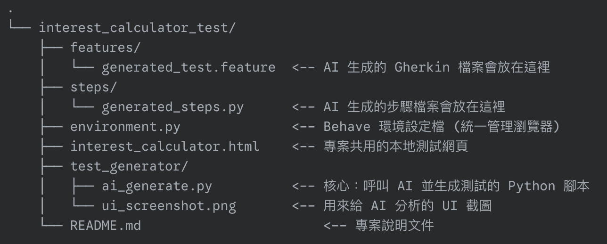

# AI 驅動之 UI 自動化測試生成器 (AI-Driven UI Autotest Generator)

本專案展示了一個完整的工作流程，說明如何使用 Google Gemini (AI) 來分析使用者介面 (UI) 的螢幕截圖，並自動生成基於 BDD (行為驅動開發) 框架 `behave` 的 Selenium 自動化測試案例。

這個專案的核心精神是「AI 輔助開發」：讓 AI 處理繁瑣的測試案例設計與初步程式碼撰寫，再由開發者進行關鍵的校驗與修正，或透過更穩定的架構來確保程式碼品質。

## 核心技術棧 (Core Technologies)

* **Python 3.x**
* **Behave**: 用於實現行為驅動開發 (BDD) 的測試框架。
* **Selenium**: 用於自動化操作網頁瀏覽器。
* **Google Gemini API**: 用於分析圖片與生成結構化數據。

## 專案結構 (Project Structure)


## 運作原理 (How It Works)

1. AI 分析: 腳本將 UI 截圖傳送給 Gemini，並透過精心設計的提示 (Prompt)，要求 AI 僅分析圖片內容並回傳結構化的數據 (JSON)，內容包含 Gherkin 腳本和使用者操作的步驟與數值。
2. Python 生成: 腳本接收到 AI 回傳的 JSON 數據後，會內建一個 Python 程式碼，將 AI 提供的數值填入，生成 steps/generated_steps.py 檔案。

## 🚀 安裝與設定 (Setup and Installation)

### 1️⃣ 安裝 Python 套件
建立 `requirements.txt` 檔案，內容如下：

```bash
behave
selenium
google-generativeai
pillow
```

安裝所有套件：
```bash
pip install -r requirements.txt
```
### 2️⃣ 設定 Google API 金鑰

⚠️ 請勿將金鑰寫在程式碼中。

設定環境變數：

macOS / Linux (Bash)
```bash
export GOOGLE_API_KEY="貼上您的金鑰"
```


Windows (CMD)
```bash
set GOOGLE_API_KEY="貼上您的金鑰"
```
## 使用流程 (Workflow)

### 📸 步驟 1: 產生測試腳本

1. 準備 UI 截圖，命名為 ui_screenshot.png 並放入 test_generator 資料夾。

2. 切換目錄並執行生成腳本：

```bash
cd interest_calculator_test/test_generator
python3 ai_generate.py
```
成功後，AI 將會自動在 features/ 與 steps/ 中生成測試檔案。

### 🧪 步驟 2: 執行自動化測試
執行 behave：

```bash
behave
Behave 會自動尋找 feature 與 steps 檔案，並根據 environment.py 設定啟動瀏覽器，完成測試流程。
```